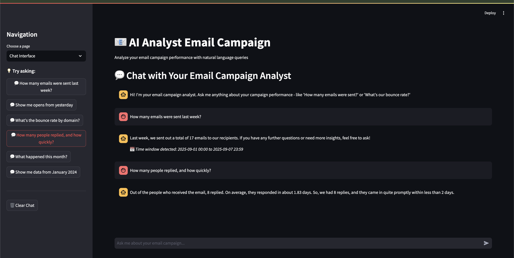

# AI Analyst Email Campaign

Prototype that analyzes a mock email campaign database and answers natural-language questions regarding the email campaign.



## Setup

Requirements: Python 3.8+

```bash
python3 -m venv .venv
source .venv/bin/activate
pip install -r requirements.txt
```

Seed the database with realistic mock data (~140 rows):

```bash
python -m src.data.seed
```

## Quick Start


1. **Configure credentials**:

```bash
export OPENAI_API_KEY=your_api_key
# Optional: choose a lightweight model
export OPENAI_MODEL=gpt-4o-mini
```

2. **Launch the web app** (recommended):
   ```bash
   streamlit run streamlit_app.py
   ```

3. **Or Use the CLI** for quick queries:
   ```bash
   python cli_app.py "How many emails were sent last week?"
   ```


## Schema Overview

SQLite file: `email_campaign.db`

Table `email_events`:

- `id` INTEGER PRIMARY KEY
- `email_address` TEXT NOT NULL
- `first_name` TEXT
- `last_name` TEXT
- `company` TEXT
- `subject` TEXT
- `campaign_name` TEXT NOT NULL
- `sent_at` TEXT (ISO8601) NOT NULL
- `delivered_at` TEXT (ISO8601) NULL
- `opened_at` TEXT (ISO8601) NULL
- `replied_at` TEXT (ISO8601) NULL
- `bounced` INTEGER NOT NULL DEFAULT 0

Indexes:

- `idx_email_domain` on `email_address`
- `idx_campaign_sent` on `(campaign_name, sent_at)`

## Assumptions & Limitations
1. **SQL Agent**
   - Assumption: System falls back to keyword matching when OpenAI is unavailable
   - Limitation: Only supports single-metric queries, not complex multi-metric analysis

2. **Time Parsing**
   - Assumption: All time parsing assumes local system timezone
   - Limitation: Complex time expressions may not be parsed correctly


## Decision Log

- Product: Added `bounced` and domain grouping to surface deliverability issues at a glance.
- Product: Included `company` and `subject` to allow future segmentation without changing schema.
- Product: Implemented natural language response formatting to make data insights more accessible and conversational.

- Technical: Used SQLite for zero-config persistence and easy distribution; Pandas+Faker to quickly generate realistic mock data.
- Technical: Implemented OpenAI SQL agent for natural language to SQL conversion with comprehensive read-only safety validation.
- Technical: Time parsing pipeline using pattern matching and dateutil (eg: last week, yesterday).
- Technical: Added LLM-powered response formatting that converts raw results into natural, conversational language.

